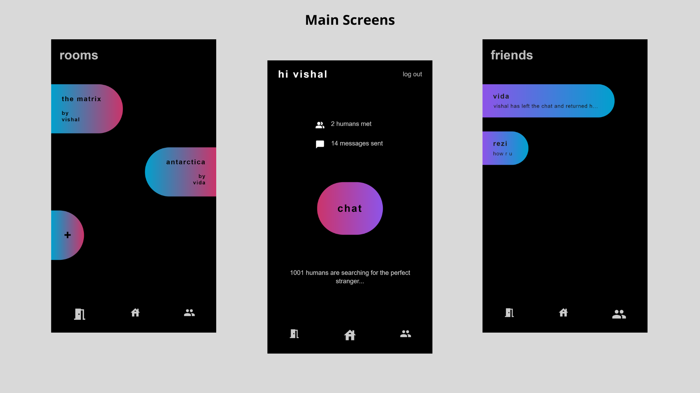
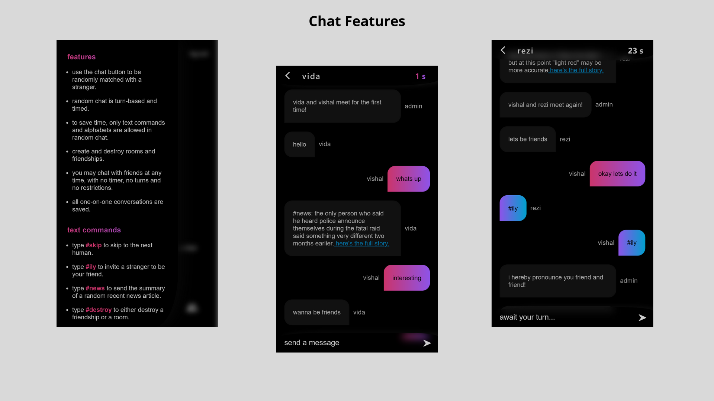

# asteroid

**_Note: This project is still in progress._**

### Try it:

- Please use the "Add To Home Screen" feature of your browser for the best experience if you are going to visit the site on a mobile device. The final product will be a PWA.
- If you are the only person online (very likely), the best way to use it would be to use two different browsers or devices (or using a normal tab and an incognito tab on a single browser) to visit, register and then hit the chat button on www.asteroid.chat

### Building Blocks

- ReactJS
- Node.js
- Express.js
- MongoDB
- Socket.io
- NewsAPI

### Screenshots:

_Note: This is not the final version._

### Features:

Asteroid is a chat application based on the same basic premise as existing services like Omegle and OmeTV. It exists to help you connect and have conversations with random strangers from around the world.

- Users in random chat speak according to a turn-based system. After sending a message the user must sit back and wait for the other user to send a message before they can do so again.
- A user in random chat must send a message within 40 seconds when it is their turn to do so. When the timer reaches zero, they are returned to their home screen.
- If two users in random chat successively send the command #ily to each other, they become friends and gain the ability to remain in touch outside the limitations of random chat through the "friends" screen.
- The #destroy command can be used to destroy a friendship. Doing so will remove the friend from each others' "friends" screen, but all messages are still saved in the server. So, if the two individuals were to meet again in random chat, they would be able to see all their previous messages, pick up where they left off and perhaps become friends again.
- Using the #destroy command as the creator in a room in the "rooms" screen however, will kick everyone out of the room, destroy it and delete all it's messages from the server.
- For the sake of brevity and a consistent aesthetic, there are limitations to the size and type of the message content.
- Users may use tools such as the #news command to help spark a conversation. Sending the #news command returns the summary of a randomly picked recent news article from NewsAPI. A few more interesting commands will be added soon.
